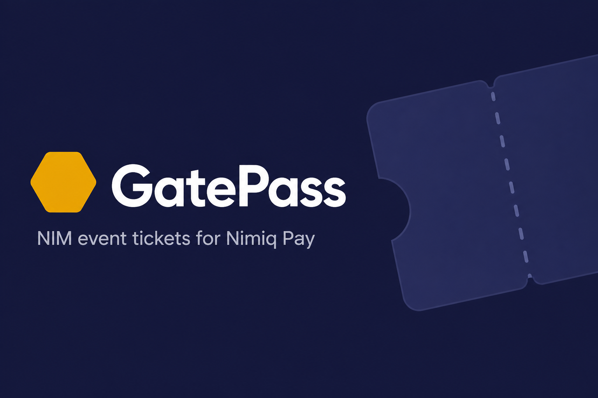

# GatePass



NIM-native event ticketing Mini App for **Nimiq Pay**.

Create an event → attendees pay NIM → rotating TOTP QR at the door → offline-capable gate scan → Proof of Attendance badge after the event.

## Stack

- `apps/web` — Vue 3 + Vite + `@nimiq/mini-app-sdk` (Nimiq gold/navy UI)
- `apps/api` — Hono + SQLite (events, payment verify, tickets, redeem)
- `packages/shared` — types + TOTP / QR helpers

No USDC, no browser-node wallets, no L1 NFT contracts — tickets are cryptographic credentials backed by NIM payments.

## Quick start

```bash
npm install
export SKIP_TX_VERIFY=true   # demo purchases without chain
npm run dev:api              # http://localhost:8787
npm run dev:web              # http://localhost:5173
```

Or:

```bash
docker compose up --build
```

Open `http://localhost:5173` (browser demo) or load the Vite **Network** URL inside **Nimiq Pay → Mini Apps**.

### Happy path (demo)

1. **Discover** (home) → browse upcoming events → open one  
2. **Get demo ticket** (or Pay with NIM in Nimiq Pay) → lands in **Tickets** with rotating QR  
3. **Host** → create event → copy/save gate unlock QR  
4. **Gate** → unlock with organizer QR → scan ticket QR  
5. After event end + 24h, a redeemed ticket shows the **Proof of Attendance** badge  

### Real NIM payments (Nimiq Pay)

1. Run API against the network you want:

```bash
# Mainnet (default RPC: https://rpc.nimiqwatch.com)
NIMIQ_NETWORK=mainnet SKIP_TX_VERIFY=false npm run dev:api

# Testnet — supply your own history-node RPC
NIMIQ_NETWORK=testnet NIMIQ_RPC_URL=http://<your-testnet-rpc>:8648 SKIP_TX_VERIFY=false npm run dev:api
```

2. Open the Mini App inside Nimiq Pay on the same LAN (`npm run dev:web -- --host`).
3. Organizer connects wallet (receive address must match the Pay network).
4. Attendee taps **Pay with NIM** → Nimiq Pay confirms `sendBasicTransactionWithData` with memo `GATEPASS:<eventId>`.
5. API polls `getTransactionByHash` until confirmations ≥ `NIMIQ_MIN_CONFIRMATIONS`, checks recipient / amount / memo / sender, then issues the ticket seed.
6. If the app closes after payment but before claim, reopen Tickets — pending `txHash` is resumed from `localStorage`.

Check `/network` for RPC reachability and tip height.

Deeplink shape: `nimiqpay://miniapp?url=<your-hosted-url>`

## Deploy (Railway)

One service serves the Mini App + API (same origin, `/api/*`).

```bash
# Install CLI once: https://docs.railway.com/guides/cli
npm i -g @railway/cli
railway login
railway init          # create / link project
railway up            # build Dockerfile + deploy
railway volume add --mount-path /data   # persist SQLite
railway domain        # public HTTPS URL
```

Set variables (Railway dashboard or `railway variables`):

| Variable | Suggested |
|----------|-----------|
| `DB_PATH` | `/data/gatepass.db` |
| `NIMIQ_NETWORK` | `mainnet` |
| `SKIP_TX_VERIFY` | `true` (demo tickets still work; **real Pay txs are verified**) |
| `VITE_ALLOW_DEMO` | bake at build time via Dockerfile `ARG` (default `true`) |

Open the public URL in a browser, then in Nimiq Pay:

`nimiqpay://miniapp?url=https://YOUR-DOMAIN`

## Scripts

| Command | Description |
|---------|-------------|
| `npm run dev:web` | Vite Mini App |
| `npm run dev:api` | API server |
| `npm test` | TOTP golden-vector tests |
| `npm run build` | Build shared + api + web |

## Privacy

See [docs/privacy.md](docs/privacy.md). Private keys never leave Nimiq Pay. The API stores event metadata, NIM addresses, ticket ids, and payment tx hashes.

## License

MIT
